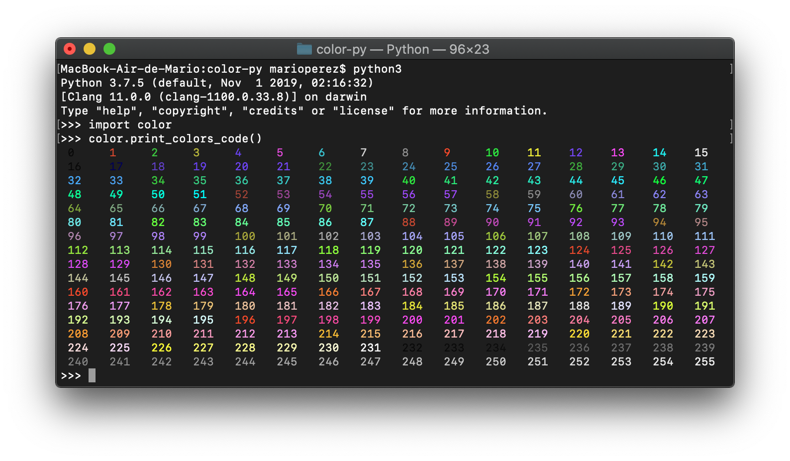
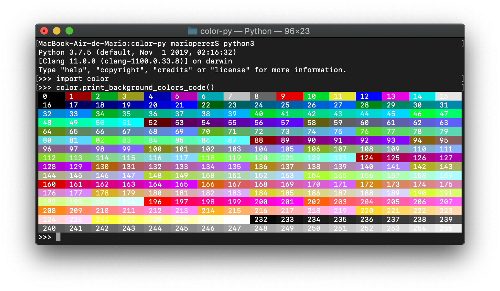
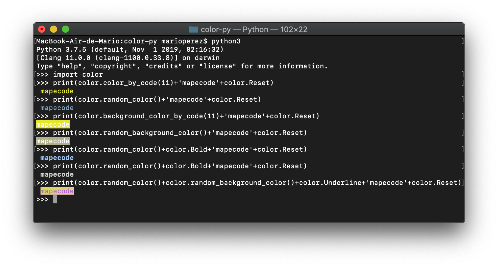

# color-py
Print with all colors in Python

## Usage
* Clone the repository
* Copy **color.py** to your project
* Import and print with color :)

## Examples
### Print all colors with his code

### Print all background colors with his code

### Other possibilities

